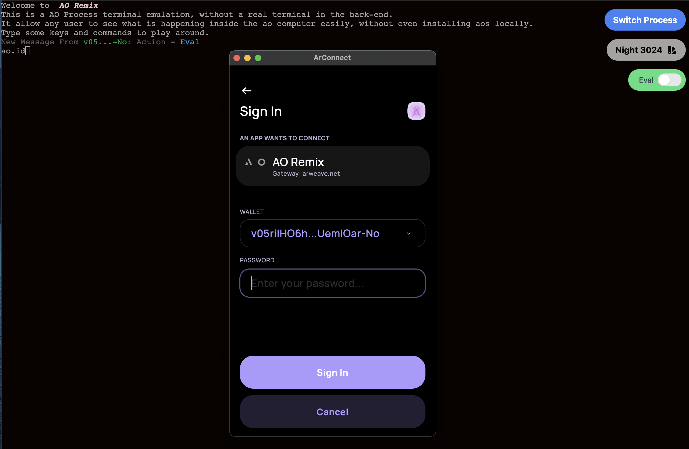
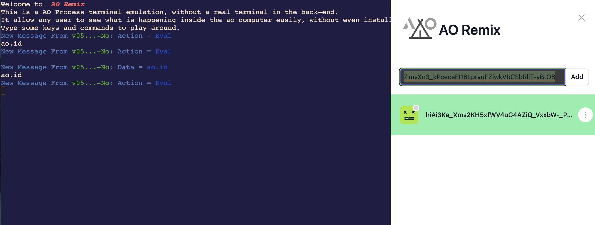

ao process remix web app with <b>Vitesse</b> 

 

<a href="https://link.yaha.me/">Live Demo</a> |
<a href="https://youtu.be/aDRuaIlfM8M">Video Demo</a>

 
 

## What it do durning Weave Hackathon

- [x] Home Page to input new process id
- [x] Terminal like page for each process id
- [x] SlideOver in detail page to switch to different process
- [x] List/Send command in terminal page
- [x] Auto load new message while new message arrived in process
- [x] Add video demo
- [x] Deploy on vercel to have demo url
- [x] Add `Eval` action toggle button to setup if we send the text as command or just text

## How to use this code?

I build this by the vue starter, pls check [vitesse](https://github.com/antfu/vitesse)
